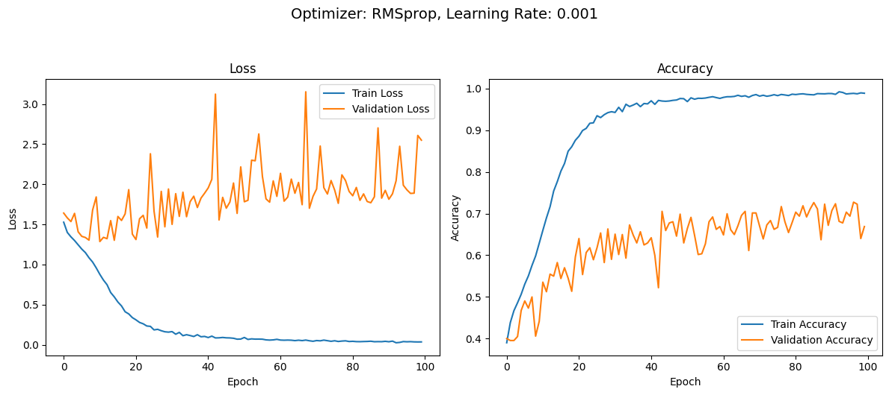
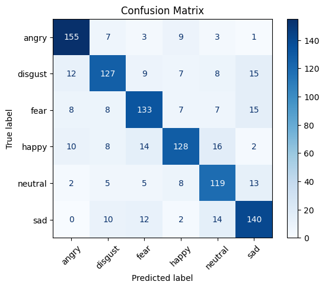
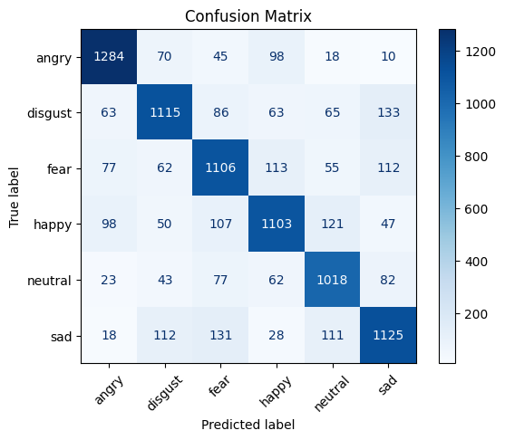
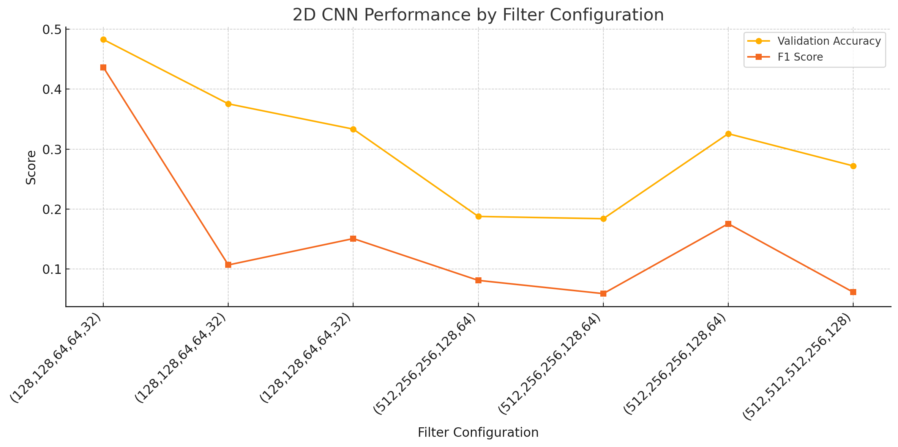
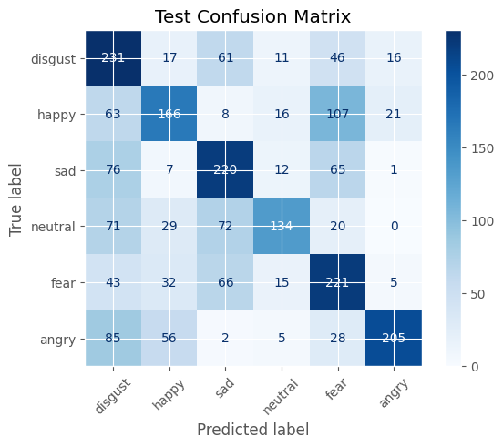

---

# Speech Emotion Recognition

Colab Link: 
[Google Colab Link](https://colab.research.google.com/drive/1nOG9a6u3uuNlBsVXu1CkyhdV1STX7pC8?usp=sharing)

---

## Problem Statement

Goal:
- Build a Speech Emotion Recognition (SER) system to classify emotions from audio using the CREMA-D dataset.

Tasks:
- Data Loading: Load and explore the dataset, listen to samples, and plot waveforms.
- Feature Extraction:
  - Time/Frequency domain: e.g., zero-crossing rate, energy
  - Mel-spectrograms for image-like input
- Model Building:
  - Use 1D CNNs for 1D features and 2D CNNs for spectrograms
- Train/test split:
  - 70%/30%, with 5% of training for validation (set seed = 42, stratified)
- Evaluation:
  - Report accuracy and F1 scores
  - Plot confusion matrices and identify most confusing classes

---

## Team Members

| Name                      | ID       |
| ------------------------- | -------- |
| محمد حسن محمد قباري       | 21011115 |
| عمر هاني إبراهيم محمد بشر | 21010891 |
| محمد محمد إبراهيم علي حسن | 21011211 |

---

## Data Loading

- **Import main data**
- Using **Kaggle** to import dataset
- Reading **CREMA** dataset only

---

## Listen to and Plot Waveform of Each Class

- Using `librosa.display.waveshow` and `IPython.display.Audio`
- Plotting **Short-Term Fourier Transform**

---

## Data Augmentation

- Adding:

  - Noise
  - Stretching
  - Shifting
  - Pitch shifting

---

## Feature Extraction

### 1D

- Extract features using **Librosa**

### 2D

- Using **TorchAudio**
- Convert signal to **mel spectrogram**
- Convert spectrogram into **decibels**

---

## 1D Convolution

### Data Processing

- Apply **Normalization** using `scikit-learn StandardScaler`
- Apply **One-Hot Encoding**

### Architecture

#### 🔁 Convolutional Block (Feature Extraction)

1. **Conv Layer 1**
   `Conv1d(1 → 512, kernel_size=5, stride=1, padding=2)`
   ReLU → `BatchNorm1d(512)` → `MaxPool1d(kernel_size=5, stride=2, padding=2)`

2. **Conv Layer 2**
   Same settings as Layer 1

3. **Conv Layer 3**
   `Conv1d(512 → 256)` → ReLU → `BatchNorm1d(256)` → MaxPool

4. **Conv Layer 4**
   `Conv1d(256 → 256, kernel_size=3, stride=1, padding=1)`
   ReLU → `BatchNorm1d(256)` → `MaxPool1d(kernel_size=5, stride=2, padding=2)`

5. **Conv Layer 5**
   `Conv1d(256 → 128)`
   ReLU → `BatchNorm1d(128)` → `MaxPool1d(kernel_size=3, stride=2, padding=1)`

#### 🔗 Fully Connected Block (Classification)

- Flatten
- `Linear(128 × 7 → 512)` → ReLU → `BatchNorm1d(512)`
- `Linear(512 → 6)`

---

## Hyperparameter Tuning

### Training with Adam

- Learning Rate: **0.01**, **0.001**

### Training with SGD

- Learning Rate: **0.01**, **0.001**

### Training with RMSprop

- Learning Rate: **0.01**, **0.001**

---

## Best Optimizer

- **Optimizer:** Adam
- **Learning Rate:** 0.001
- **Epochs:** 100

### Evaluation

- **Accuracy:** 0.7697
- **F1 Score (Micro):** 0.7697
- **F1 Score (Macro):** 0.7686
- **F1 Score (Weighted):** 0.7692

---

## Evaluate Model on Test Data

- **Accuracy:** 0.7559
- **F1 Score (Micro):** 0.7559
- **F1 Score (Macro):** 0.7557
- **F1 Score (Weighted):** 0.7557

---

## 2D Conv

### Architecture & Hyperparameter Tuning

**Training 2D CNN** with various configurations:

| Filters                   | Kernels                                   | Val Acc | F1 Score |
| ------------------------- | ----------------------------------------- | ------- | -------- |
| (128, 128, 64, 64, 32)    | \[(1, 3), (3, 5), (3, 5), (3, 3), (3, 3)] | 0.4828  | 0.4364   |
| (128, 128, 64, 64, 32)    | \[(3, 5), (3, 5), (3, 5), (3, 3), (3, 3)] | 0.3755  | 0.1068   |
| (128, 128, 64, 64, 32)    | \[(5, 5), (5, 5), (3, 5), (3, 3), (1, 3)] | 0.3333  | 0.1508   |
| (512, 256, 256, 128, 64)  | \[(1, 3), (3, 5), (3, 5), (3, 3), (3, 3)] | 0.1877  | 0.0811   |
| (512, 256, 256, 128, 64)  | \[(3, 5), (3, 5), (3, 5), (3, 3), (3, 3)] | 0.1839  | 0.0590   |
| (512, 256, 256, 128, 64)  | \[(5, 5), (5, 5), (3, 5), (3, 3), (1, 3)] | 0.3257  | 0.1756   |
| (512, 512, 512, 256, 128) | \[(1, 3), (3, 5), (3, 5), (3, 3), (3, 3)] | 0.2720  | 0.0614   |

---

## Evaluate Model on Test Data

Test Accuracy: 0.5271
Test F1 Score: 0.5317

---
